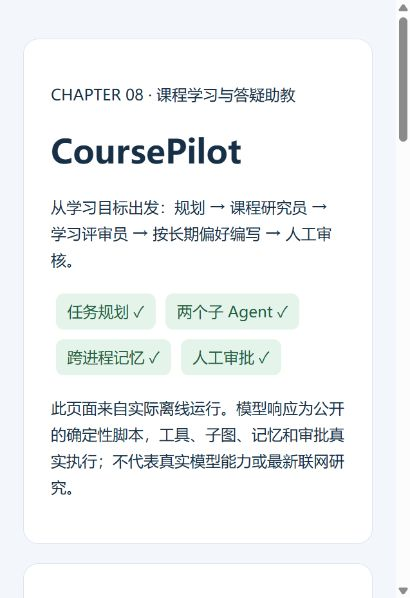
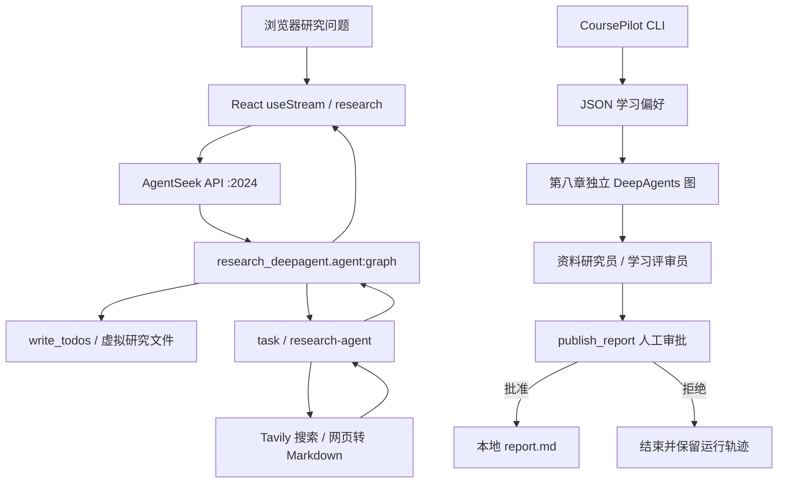
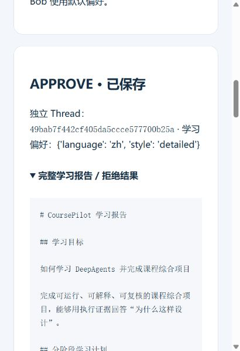
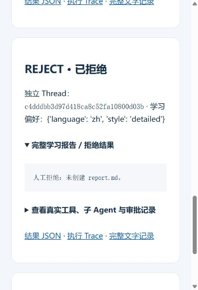

# Research DeepAgent：研究应用与 DeepAgents 课程工作区

本项目包含浏览器研究应用、第二至第七章的能力练习，以及第八章 CoursePilot 课程学习与答疑助教。它们共用根目录的 Python 依赖，但运行入口、配置和验收范围各自独立。

下图展示第八章 CoursePilot 的实际离线演示：从学习目标出发，完成任务规划、两个子 Agent 协作、跨进程记忆和人工审批。Research Web 的运行方式见后文。



| 使用目标 | 当前入口 | 配置与详细说明 |
| --- | --- | --- |
| 浏览器提交研究问题，查看规划、工具调用与引用报告 | 项目根目录执行 `uvx agentseek dev` | 根 `.env`、`frontend/.env`；启动行为由 [.agentseek/lifecycle.toml](.agentseek/lifecycle.toml) 声明 |
| 演示课程规划、子 Agent、长期记忆与人工审批 | `.\.venv\Scripts\python.exe -m chapter08.demo demo`，真实模式另有 [start_live.bat](src/chapter08/start_live.bat) | `src/chapter08/.env`；完整说明见 [CoursePilot README](src/chapter08/README.md) |
| 学习单项能力 | 分别运行 `src/chapter02` 至 `src/chapter07` 的练习脚本 | 阅读对应脚本的模型、工具与路径配置 |

AgentSeek 是外部生命周期 CLI；研究图由本项目的 `create_deep_agent(...)` 构建，通过 AgentSeek API 提供服务。下文命令默认使用 Windows PowerShell，且在**包含 `pyproject.toml` 和 `uv.lock` 的项目根目录**执行。

- [环境安装](#环境安装)
- [快速启动](#快速启动)
- [API 配置](#api-配置)
- [CLI 使用](#cli-使用)
- [目录与架构](#目录与架构)
- [开发测试](#开发测试)
- [验收反馈](#验收反馈)
- [故障排查](#故障排查)
- [许可现状](#许可现状)

## 环境安装

| 环境或组件 | 要求与用途 |
| --- | --- |
| Python | `>=3.12`，以 [pyproject.toml](pyproject.toml) 为准 |
| uv / uvx | 安装 Python 依赖、运行项目与外部 CLI；安装方法见 [uv 官方文档](https://docs.astral.sh/uv/getting-started/installation/) |
| Node.js / npm | Research Web 前端需要；版本须满足 Vite 与开发依赖的 `engines`，建议使用 Node.js 24.x；参见 [Vite 环境要求](https://vite.dev/guide/) |
| DeepAgents / LangChain | Python Agent 编排；DeepAgents 约束为 `>=0.7,<0.8`，精确版本由 [uv.lock](uv.lock) 锁定 |
| AgentSeek API | 根依赖固定为 `agentseek-api[embedded]==0.2.3`，提供研究图 HTTP API 与状态存储 |
| 网络与凭据 | Web 研究与 CoursePilot 真实模式需要；CoursePilot 离线模式安装后无需 API Key |

```powershell
Set-Location 'D:\2026项目\20260910deepagents\agentseek\research_deepagent'
uv sync --locked

# 仅运行 Web 应用时安装前端依赖
npm install --prefix frontend
```

其他机器请替换项目路径。`uv sync --locked` 按锁文件同步 `.venv`，锁文件与依赖声明不一致时会报错，见 [uv 锁定与同步说明](https://docs.astral.sh/uv/concepts/projects/sync/)。当前仓库未提交前端锁文件，因此前端使用 `npm install`，不能宣称 npm 依赖已完全锁定。

**Web 默认嵌入式数据库存在平台限制。** 当前 `uv.lock` 中的 `pylibseekdb` 仅为 Linux 和 macOS arm64 声明依赖，本机 Windows 环境缺少该绑定。默认 `SEEKDB_EMBED=true` 的 Web 后端宜在支持该绑定的环境（如 Linux / WSL）单独安装、运行；Windows 原生启动不能仅凭依赖安装成功认定可用。CoursePilot CLI 不使用这个 HTTP 后端或数据库。

## 快速启动

### Research Web 应用

先安装上节依赖，并按「API 配置」填写根 `.env`。以下命令仅在配置文件不存在时创建或复制，保留已有配置：

```powershell
if (-not (Test-Path -LiteralPath '.env')) {
    New-Item -ItemType File -Path '.env' | Out-Null
}
if (-not (Test-Path -LiteralPath 'frontend/.env')) {
    Copy-Item -LiteralPath 'frontend/.env.example' -Destination 'frontend/.env'
}
```

配置完成后执行：

```powershell
uvx agentseek info
uvx agentseek doctor
uvx agentseek dev --dry-run
uvx agentseek dev
```

`dev` 启动 lifecycle 中声明的后端与前端；`--dry-run` 只展示启动计划。在另一个位于项目根目录的终端执行 `uvx agentseek doctor --live`，检查已经启动的服务。命令语义见 [AgentSeek 官方 CLI 文档](https://github.com/ob-labs/agentseek/blob/main/docs/reference/cli.md)。

| 服务 | 默认地址 | 用途 |
| --- | --- | --- |
| 研究界面 | [http://127.0.0.1:5174](http://127.0.0.1:5174) | 输入问题，查看流式回答、规划与工具卡片 |
| AgentSeek API | [http://127.0.0.1:2024](http://127.0.0.1:2024) | 运行 `research` 图 |
| 后端健康检查 / API 文档 | `/health` / `/docs`，位于上述 API 地址 | 服务检查与接口调试 |

可输入「比较 LangGraph 1.0 与 0.x 的主要变化，优先引用官方资料」。正常情况下会出现 Research plan、搜索或子 Agent 工具卡片，以及带链接引用的 Markdown 回答。结束开发会话时在启动终端按 `Ctrl+C`。

### CoursePilot CLI

安装 Python 依赖后，可以立即运行无需密钥的离线演示：

```powershell
.\.venv\Scripts\python.exe -m chapter08.demo demo
```

它实际执行 DeepAgents 图、两个子 Agent、批准 / 编辑 / 拒绝三条分支和跨进程记忆检查，最后打印新建的 `demo.html` 路径。

调用真实模型前填写 `src/chapter08/.env`，然后双击 [src/chapter08/start_live.bat](src/chapter08/start_live.bat)，或执行：

```powershell
.\.venv\Scripts\python.exe -m chapter08.demo run --mode live
```

草稿生成后，输入 `approve` 保存报告，输入 `edit` 修改标题并再次确认，输入 `reject` 拒绝保存。真实入口使用默认用户 `alice` 与本章 `.data`，无需启动 Web 服务。macOS / Linux 将解释器路径替换为 `./.venv/bin/python`；批处理入口只适用于 Windows。

## API 配置

### Research Web：根 `.env`

新环境可按以下样例填写根 `.env`；所有密钥占位符都应替换为自己的值：

```dotenv
AGENTSEEK_MODEL_PROVIDER=openai
AGENTSEEK_MODEL=gpt-4.1-mini
OPENAI_API_KEY=替换为模型服务密钥
# 自定义兼容网关时填写其实际接口地址
OPENAI_API_BASE=
TAVILY_API_KEY=替换为Tavily密钥

SEEKDB_EMBED=true
SEEKDB_EMBED_DIR=~/.agentseek/research_deepagent/seekdb
OCEANBASE_DB_NAME=test
LANGCHAIN_OPENAI_STREAM_CHUNK_TIMEOUT_S=300
```

| 原生供应商选择值 | 必填密钥 | 可选接口地址 |
| --- | --- | --- |
| `openai` | `OPENAI_API_KEY` | `OPENAI_API_BASE` |
| `anthropic` | `ANTHROPIC_API_KEY` | `ANTHROPIC_API_URL` |
| `google_genai`，别名 `google` / `gemini` | `GOOGLE_API_KEY` | `GOOGLE_API_BASE` |

切换供应商时，同时把 `AGENTSEEK_MODEL` 改为该服务实际提供的模型 ID。研究图没有原生 `deepseek` 或 `glm` Provider；使用 OpenAI 兼容服务时选择 `openai`，并设置对应的 `OPENAI_API_KEY`、`OPENAI_API_BASE` 和模型 ID，兼容性需要实际调用验证。

模型选择优先级为 **`AGENTSEEK_MODEL` → `DEEPAGENTS_MODEL` → `BUB_MODEL` → `gpt-4.1-mini`**。模型可带受支持的供应商前缀；若前缀与显式 Provider 冲突，启动会报错。未显式传入地址时，底层 SDK 可能采用自身默认值或环境变量；需要固定端点时应明确填写地址。

正式 API 启动入口通过 [langgraph.json](langgraph.json) 预加载根 `.env`。当前 API CLI 保留已有进程环境变量的优先级，研究图自身的 `load_dotenv()` 也不覆盖已有值，因此出现配置串用时应核对终端环境。不要把直接导入 `agent.py` 当作等价启动方式：搜索客户端在模块导入期间就会初始化。

`TAVILY_API_KEY` 是 Web 搜索的必需配置。`doctor` 只检查声明的凭据是否存在，不验证它是否匹配所选 Provider，也不证明密钥、模型 ID 或网关可用。`LANGCHAIN_OPENAI_STREAM_CHUNK_TIMEOUT_S` 控制 OpenAI 流式分块间隔，默认 300 秒；它不是整条研究流程的总时限。

### 浏览器：`frontend/.env`

```dotenv
VITE_LANGGRAPH_API_URL=http://127.0.0.1:2024
FRONTEND_PORT=5174
```

前者是浏览器可访问的 API 地址，后者是 Vite 端口。模型和搜索密钥留在服务端配置中；`VITE_*` 变量会暴露给浏览器，见 [Vite 环境变量说明](https://vite.dev/guide/env-and-mode)。更改配置后重启前端。若改变服务端口，还需同步 lifecycle 的服务 URL、启动命令与健康检查目标。

### CoursePilot：`src/chapter08/.env`

此模块使用独立配置。可以选用 OpenAI、GLM 或 DeepSeek；下面是 OpenAI 示例：

```dotenv
CHAPTER08_PROVIDER=openai
OPENAI_API_KEY=替换为模型服务密钥
OPENAI_MODEL=gpt-4.1-mini
OPENAI_API_BASE=https://api.openai.com/v1
# 可选：TAVILY_API_KEY=替换为搜索密钥
```

本章 `.env` 存在时，应用配置只读取该文件，不合并根 `.env` 或终端变量；文件不存在时才使用进程环境。底层 SDK 对未显式传入的参数仍可能读取环境默认值。多个供应商密钥并存时必须设置 `CHAPTER08_PROVIDER`；模型优先级为 **`CHAPTER08_MODEL` → 供应商的 `*_MODEL` → 内置默认值**。

GLM 使用 `GLM_API_KEY`、必填的 `GLM_BASE_URL` 与 `GLM_MODEL`；DeepSeek 使用 `DEEPSEEK_API_KEY`、`DEEPSEEK_BASE_URL` 与 `DEEPSEEK_MODEL`。完整默认值、GLM 推理参数及配置边界见 [第八章 API 配置](src/chapter08/README.md#api-配置)。本章 Tavily 为可选配置，缺失或搜索失败时使用官方资料快照，并标明不是实时检索。

三个 `.env` 文件均由现有忽略规则排除。提交反馈、截图或日志前移除真实密钥。

## CLI 使用

### AgentSeek 生命周期命令

| 命令 | 用途 |
| --- | --- |
| `uvx agentseek info` | 查看项目、服务与入口声明 |
| `uvx agentseek task --list` | 列出本项目的一次性任务 |
| `uvx agentseek task sync` | 按 lifecycle 执行 `uv sync`；需固定锁文件时用 `uv sync --locked` |
| `uvx agentseek task frontend` | 执行 `npm install --prefix frontend` |
| `uvx agentseek doctor` / `doctor --live` | 检查静态准备情况 / 已运行服务 |
| `uvx agentseek dev --dry-run` / `dev` | 展示计划 / 启动 Web 应用 |

排查单个进程时，可以分开执行 lifecycle 中的原生命令。两个终端均从项目根目录开始：

```powershell
# 终端 A：仅后端，仍需根 .env 与可用的数据库配置
uv run agentseek-api dev --port 2024
```

```powershell
# 终端 B：仅前端
Set-Location frontend
npm run dev
```

### CoursePilot 命令

```powershell
.\.venv\Scripts\python.exe -m chapter08.demo --help
.\.venv\Scripts\python.exe -m chapter08.demo run --help
```

| 子命令 | 用途与关键参数 |
| --- | --- |
| `run` | 单次任务；`--mode offline/live`、`--topic`、`--user-id`、`--data-dir`、`--output` |
| `remember` | 明确保存偏好；`--user-id`、`--language zh/en`、`--style concise/detailed` |
| `memory` | 查看偏好；`--user-id`、`--data-dir` |
| `demo` | 自动离线演示；可指定新建的 `--output` 目录 |
| `feedback` | 记录实际反馈；必填 `--output`、`--rating`、`--comment` |

`run` 默认 `offline`；真实调用必须加 `--mode live`，且禁止用 `--decision` 自动代替人工审批。仅运行 `demo.py` 而不指定子命令会提示缺少参数。自定义用户或偏好目录时，`remember`、`memory`、`run` 应使用同一组参数。

第二至第七章是独立练习。例如：

```powershell
.\.venv\Scripts\python.exe .\src\chapter02\deepagent.py
```

这些脚本可能在执行或导入时直接调用模型、搜索或读写练习目录；先检查该脚本的配置与路径，再单独运行，不作为 Web 或 CoursePilot 的启动入口。

## 目录与架构

```text
research_deepagent/
├── README.md                     # 全局安装、运行与验收导航
├── pyproject.toml / uv.lock       # Python 依赖声明与锁文件
├── .agentseek/lifecycle.toml      # Web 服务、进程、检查与任务
├── langgraph.json                # research 图注册、根 .env 加载
├── frontend/                     # React / TypeScript / Vite
│   ├── .env.example              # 前端配置样例
│   └── src/                      # 会话、工具卡片、规划与 Markdown 渲染
├── src/research_deepagent/        # 研究图、提示词与搜索工具
├── src/chapter02/                # DeepAgent 入门
├── src/chapter03/                # StateBackend、文件后端与基准实验
├── src/chapter04/                # 规划分解与联网探测
├── src/chapter05/                # 多 Agent 协作
├── src/chapter06/                # Skills 与相关练习
├── src/chapter07/                # 记忆与人工审批
├── src/chapter08/                # CoursePilot 独立 CLI
│   ├── start_live.bat / demo.py   # 真实入口与 CLI
│   ├── agent.py / offline.py     # 工作流与离线模型
│   ├── test_project.py           # 配置、安全与业务回归
│   ├── evidence.json             # 官方资料快照
│   └── docs/ / artifacts/        # 演示说明、验收反馈与运行证据
├── workspace/                    # 文件后端练习产物
└── 课程目标.md                   # 课程综合项目要求
```



| 关键文件 | 职责 |
| --- | --- |
| [research_deepagent/agent.py](src/research_deepagent/agent.py) | 选择 Provider / 模型，构建研究主图与研究子 Agent |
| [prompts.py](src/research_deepagent/prompts.py) / [tools.py](src/research_deepagent/tools.py) | 研究流程、引用要求、`tavily_search` 与 `think_tool` |
| [frontend/src/App.tsx](frontend/src/App.tsx) | 连接 `research` 图，流式渲染消息，使用 `?thread=` 会话链接 |
| [chapter08/demo.py](src/chapter08/demo.py) / [agent.py](src/chapter08/agent.py) | CLI、配置隔离、偏好持久化、审批与报告保存 |

研究图默认使用 `StateBackend`。提示词中的 `/research_request.md`、`/final_report.md` 是图状态里的虚拟文件，不是根目录中的宿主机文件；状态持久化由 API 运行时承担，参见 [DeepAgents 后端说明](https://docs.langchain.com/oss/python/deepagents/backends)。最多三个并行研究单元、三轮委派及搜索次数要求来自提示词，不能当作执行层硬配额。

CoursePilot 把长期偏好保存为 `.data/profiles/<user-id>.json`，会话 checkpoint 使用 `InMemorySaver`；关闭进程后不能恢复待审批状态。每次运行默认在本章 `artifacts` 创建新目录，保存 `trace.jsonl`、`transcript.md`、`result.json`；批准后另有 `report.md`。完整演示另含 `demo.html`、`summary.json` 与记忆检查，显式 `--output` 必须为空目录。

从攻击面看，两套图的权限约束也不同：Web 搜索工具直接抓取结果 URL 并跟随重定向，当前没有来源允许名单或人工审批；第八章则限制资料来源、隔离子 Agent 的发布权限，并对标题与正文绑定审批。第八章回归不能视为研究 Web 图的安全证明。

## 开发测试

安装依赖后，在根目录执行：

```powershell
# 第八章：离线模型与本地 SDK 请求体检查，不调用真实 API
.\.venv\Scripts\python.exe -m unittest chapter08.test_project -v

# Web 前端：需要先完成 npm install --prefix frontend
npm --prefix frontend test
npm --prefix frontend run build
```

第八章覆盖配置来源隔离、供应商与模型参数、跨进程偏好、路径验证、子 Agent 权限、审批参数替换、拒绝与重复保存。前端测试位于 `App.test.tsx` 和 `ToolCallCard.test.tsx`，使用模拟流验证 UI；构建执行 TypeScript 检查与 Vite 打包，这些检查不替代真实后端联调。

不要将全目录测试发现作为默认检查：第三章的 `*_test.py` 是模型实验，第四章的 `test_tavily.py` / `test_https.py` 会联网。修改依赖时同步维护 `pyproject.toml` 与 `uv.lock`；修改图 ID、端口或配置变量时同时核对 lifecycle、`langgraph.json`、前端与本文命令。

## 验收反馈

验收按实际运行路径分别记录。当前留存的完整流程证据集中在第八章，不能直接据此声明 Research Web 已通过端到端验收。

| 验收范围 | 已有证据与结论 |
| --- | --- |
| CoursePilot 离线演示 | [summary.json](src/chapter08/artifacts/demo/summary.json)、[记忆检查](src/chapter08/artifacts/demo/memory-check.json)；三种审批与跨进程偏好隔离通过 |
| CoursePilot 回归 | [最终历史日志](src/chapter08/artifacts/demo/test-results-api-ready.txt) 记录 28 项通过；2026-10-08 本次文档核对时复跑也为 28 项通过 |
| CoursePilot 真实模型 | [真实流程验证](src/chapter08/artifacts/api-workflow-check.json) 覆盖规划、两个子 Agent、审批中断与拒绝后无报告，记录耗时 145.5 秒；真实批准保存和教学质量尚未据此验收 |
| 演示与实际反馈 | [演示页面](src/chapter08/artifacts/demo/demo.html)、[演示脚本](src/chapter08/docs/DEMO_SCRIPT.md)、[FEEDBACK.md](src/chapter08/docs/FEEDBACK.md)；匿名项目用户反馈「5 分：清楚」「当前演示已够用」 |
| Research Web 联调 | 待按快速启动验证健康检查、规划、搜索、子 Agent、最终引用与会话恢复；目前未留存对应整体验收记录 |

以下是 CoursePilot 离线演示的两种审批结果；批准后保存报告，拒绝后不创建 `report.md`。完整正文和工具轨迹可在上方演示页面中展开查看。

| 批准：报告已保存 | 拒绝：未创建报告 |
| --- | --- |
|  |  |

离线脚本证明流程与执行层约束，不证明真实模型教学质量或全面抵御提示注入。`summary.json` 中的 `live_model_validation=not_run` 是首次离线演示的历史状态，后续真实调用应以独立 API 验证文件为准。

记录 CoursePilot 的后续真实反馈：

```powershell
.\.venv\Scripts\python.exe -m chapter08.demo feedback --output .\src\chapter08\artifacts\demo --rating 5 --comment '替换为实际体验反馈'
```

评分支持 1–5；输出目录必须包含完整演示的 `summary.json`，单次 `run` 目录不适用。Web 或练习脚本的问题反馈应附入口、模式、脱敏配置名称、复现步骤、预期与实际结果。

## 故障排查

| 现象 | 原因与处理 |
| --- | --- |
| 找不到 uv、uvx 或 Python | 按官方文档安装 uv 并重开终端；无可用解释器时可运行 `uv python install 3.12`，再同步项目依赖 |
| `.venv` 不存在 / `No module named chapter08` | 在项目根目录执行 `uv sync --locked`，使用项目 `.venv` 解释器 |
| Web 启动提示缺少前端路径或 Node | 安装 Node/npm 后执行 `npm install --prefix frontend`；只使用 CoursePilot 时直接运行其 CLI |
| Windows Web 后端提示缺少 `pylibseekdb` | 当前锁定的嵌入式绑定有平台限制；在支持环境重新安装 Web 依赖并启动，不把 `doctor` 通过当作数据库可用证明 |
| `doctor` 通过但模型认证失败 | 检查所选 Provider 对应的密钥、模型与地址；存在任意供应商密钥不表示配置匹配 |
| 修改根 `.env` 后仍调用旧地址或模型 | 核对终端中同名变量；API CLI 保留进程环境优先级，修改后重启后端 |
| Provider 不支持或模型前缀冲突 | 使用研究图支持的 Provider；使前缀与显式 Provider 一致，兼容网关按 `openai` 配置 |
| 前端打不开 / 无法连接后端 | 分别检查 5174 与 2024 的服务、`/health`、浏览器 API URL；Vite 使用 `strictPort`，端口被占用时直接失败 |
| 流式输出长时间等待 | 模型和工具可能执行多轮；分块超时不是流程总时限。先核对后端异常、网络与服务商模型支持情况 |
| CoursePilot 缺少密钥或提示多个供应商 | 检查本章 `.env`，多个密钥时设置 `CHAPTER08_PROVIDER`；根 Web 配置不会自动合入 |
| CoursePilot HTTP 400 / 模型不存在 | 填服务商接受的模型 ID，并检查 `CHAPTER08_MODEL` 是否覆盖供应商模型变量 |
| `demo.py` 提示缺少参数 / 没有真实调用 | 必须指定子命令；`run` 默认离线，真实任务使用 `run --mode live` |
| 输出目录非空 / 审批后关闭窗口 | 使用默认新建目录或空目录；待审批状态只在进程内，关闭后需重新运行 |

## 许可现状

当前项目未提供已确认的 `LICENSE`、独立 `CONTRIBUTING` 文件或 `pyproject.toml` 许可字段。本 README 不另行指定许可证；项目许可应由维护者明确补充，上游模板和依赖的许可不能代替本项目声明。

提交修改时，请保持入口、配置、文档与实际实现一致，并提供与修改范围相符的测试或运行证据。
