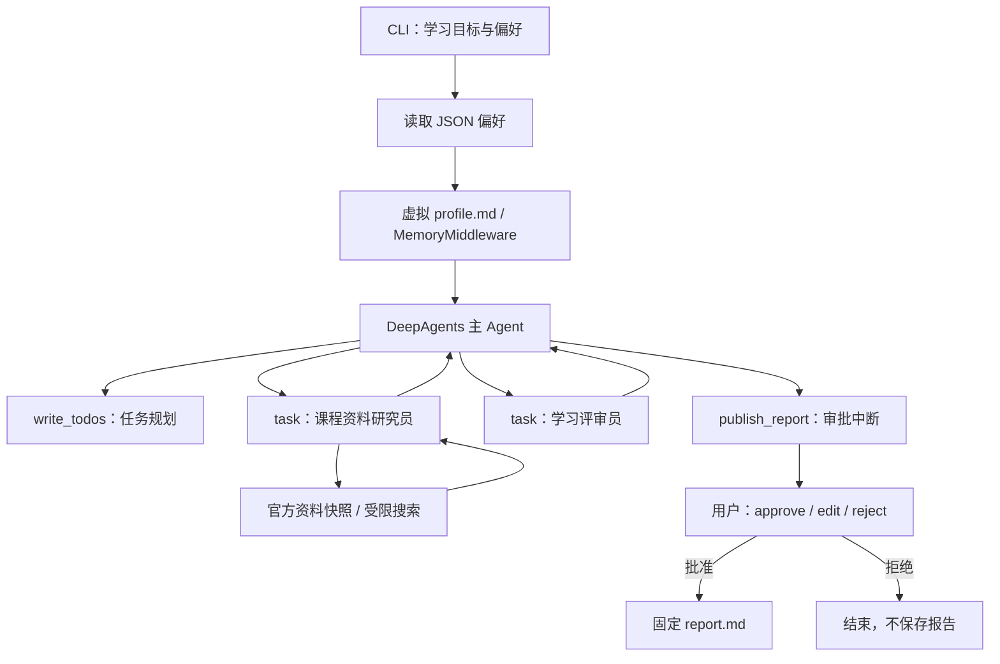

# CoursePilot：课程学习与答疑助教

CoursePilot 将学习目标转成学习计划、练习、自测和参考资料，再由用户审核是否保存报告。项目同时使用任务规划、子 Agent、长期记忆和 Human-in-the-Loop 四项课程能力。

这是 `research_deepagent` 项目中的独立 CLI 模块。**真实 API 一键入口是 [start_live.bat](start_live.bat)**；无需启动 AgentSeek 前端或后端。随附资料以 DeepAgents 课程为主。

## 目录

- [项目简介](#项目简介)
- [技术栈与环境](#技术栈与环境)
- [快速开始](#快速开始)
- [API 配置](#api-配置)
- [命令行使用](#命令行使用)
- [项目结构与运行产物](#项目结构与运行产物)
- [架构与关键代码](#架构与关键代码)
- [开发与测试](#开发与测试)
- [演示验收与反馈](#演示验收与反馈)
- [常见问题](#常见问题)
- [边界与限制](#边界与限制)
- [贡献与许可](#贡献与许可)
- [参考资料](#参考资料)

## 项目简介

学习材料需要说明学习顺序、练习方法、资料依据和完成标准。CoursePilot 用以下流程保留这些信息，并避免未经审核就保存模型生成的报告。

| 能力 | 实现 | 作用 |
| --- | --- | --- |
| 任务规划 | `TodoListMiddleware`、`write_todos` | 拆解学习目标，记录任务进度 |
| 子 Agent | `task` 委派资料研究员与学习评审员 | 分别收集依据、检查知识缺口与安全风险 |
| 长期记忆 | 本地 JSON 偏好、虚拟 `/profile.md`、`MemoryMiddleware` | 跨进程复用用户明确保存的语言和详细程度 |
| 人工审批 | `publish_report` 的审批中断 | 用户批准、修改标题或拒绝保存报告 |

输入是学习目标和学习偏好；批准后的输出是 Markdown 报告。每次运行另存工具轨迹和运行结果，方便调试、复核与演示。

## 技术栈与环境

| 项目 | 要求或用途 |
| --- | --- |
| Python | `>=3.12`，以根目录 `pyproject.toml` 为准 |
| uv | 安装依赖、创建项目 `.venv`；安装方法见 [uv 官方文档](https://docs.astral.sh/uv/getting-started/installation/) |
| DeepAgents | `>=0.7,<0.8`，任务规划、子 Agent、虚拟文件和记忆中间件 |
| LangChain / LangGraph | Agent 编排、工具执行、审批中断和进程内 checkpoint |
| langchain-openai / python-dotenv | 兼容 API 客户端、读取本章配置 |
| Tavily | 可选的官方资料搜索；无搜索 Key 时使用资料快照 |
| 本地目录 | 保存偏好、报告和运行轨迹，需要写入权限 |

依赖统一声明在 [pyproject.toml](../../pyproject.toml)，版本锁定在 [uv.lock](../../uv.lock)。本章没有独立依赖安装文件、HTTP 服务或数据库。真实模式需要网络与有效 API 配置；离线模式安装完成后无需模型 Key。

## 快速开始

以下命令使用 Windows PowerShell。除特别说明外，均在**包含 `pyproject.toml` 和 `uv.lock` 的项目根目录**执行。

### 1. 安装依赖

```powershell
Set-Location 'D:\2026项目\20260910deepagents\agentseek\research_deepagent'
uv sync --locked
```

其他机器按实际检出位置进入项目根目录。若尚未安装 uv，可先按上方官方文档安装。

### 2. 配置真实 API

配置文件是 `src/chapter08/.env`，当前本地完整路径为：

```text
D:\2026项目\20260910deepagents\agentseek\research_deepagent\src\chapter08\.env
```

已有有效配置时保留原值即可。新环境可按以下 SiliconFlow GLM 示例填写，密钥必须替换为自己的值：

```dotenv
GLM_API_KEY=替换为你的API密钥
GLM_BASE_URL=https://api.siliconflow.cn/v1
GLM_MODEL=zai-org/GLM-5.3
```

该接口的模型 ID 采用 `zai-org/GLM-5.3`，见 [SiliconFlow 官方说明](https://www.siliconflow.com/zh-tw/blog/glm-5.3-now-live-on-siliconflow)。其他服务商应填写其实际支持的接口地址与模型 ID。

### 3. 启动与审批

双击本章的 [start_live.bat](start_live.bat)，或执行等价命令：

```powershell
.\.venv\Scripts\python.exe -m chapter08.demo run --mode live
```

脚本自动定位项目根目录并使用根目录 `.venv`。模型需要执行多轮调用，出现 `[START]` 后请等待；完整草稿生成后显示 `[HITL]` 和待保存的标题、正文。

| 输入 | 行为 |
| --- | --- |
| `approve` | 保存当前完整报告 |
| `edit` | 修改标题，重新展示完整参数；再次输入 `approve` 才保存 |
| `reject` 或首次提示直接回车 | 拒绝保存，本次运行结束 |

首次审批输入其他词会报错。结束时 `[DONE]` 显示决定、保存状态及输出目录；批准后的文件为该目录中的 `report.md`。

macOS / Linux 在完成相同安装与配置后，使用 `./.venv/bin/python -m chapter08.demo run --mode live`；批处理入口只适用于 Windows。

## API 配置

应用通过 `api_settings()` 加载配置。本章 `.env` 存在时，该函数只读取这个文件：不读取父目录 `.env`，不合并终端变量，不执行变量插值，也不修改进程环境。只有本章 `.env` 不存在时，配置加载器才使用进程环境变量。

| 供应商 | 选择值 | 密钥 | 接口地址 | 默认模型 |
| --- | --- | --- | --- | --- |
| GLM | `glm` | `GLM_API_KEY` | 必填 `GLM_BASE_URL` | `zai-org/GLM-5.3` |
| OpenAI | `openai` | `OPENAI_API_KEY` | 可选 `OPENAI_API_BASE` | `gpt-4.1-mini` |
| DeepSeek | `deepseek` | `DEEPSEEK_API_KEY` | 可选 `DEEPSEEK_BASE_URL`；默认 `https://api.deepseek.com` | `deepseek-chat` |

底层 SDK 仍可能读取应用未显式传入的环境参数。例如 OpenAI 未设置 `OPENAI_API_BASE` 时，接口地址可来自终端环境；需要固定官方地址时，在本章 `.env` 设置 `OPENAI_API_BASE=https://api.openai.com/v1`。GLM 的地址必填并显式传入，不依赖这一默认地址机制。

只有一个供应商密钥时自动选择；多个供应商密钥并存时，必须设置 `CHAPTER08_PROVIDER`。模型选择顺序为：**`CHAPTER08_MODEL` → 供应商专用模型变量 → 表中的默认模型**。供应商专用变量分别是 `GLM_MODEL`、`OPENAI_MODEL`、`DEEPSEEK_MODEL`。

| 可选配置 | 说明 |
| --- | --- |
| `CHAPTER08_PROVIDER` | `glm` / `openai` / `deepseek`；显式选择供应商 |
| `CHAPTER08_MODEL` | 覆盖所选供应商的模型配置 |
| `GLM_REASONING_EFFORT` | `low` / `high` / `max`；本项目默认 `low`，仅对 GLM 供应商的 GLM-5.3 模型发送 |
| `TAVILY_API_KEY` | 启用官方资料搜索，与模型共用本章配置来源 |

API 使用流式请求，网络读取超时为 60 秒、失败最多重试一次；流式模式下这不是整条工作流的总时限。GLM-5.3 服务默认推理强度为 `max`，本项目为课程演示选择 `low` 以减少等待，支持的强度见上述官方说明。

未配置 Tavily、搜索失败或未返回允许的来源时，使用 [evidence.json](evidence.json) 中的官方资料快照，并标明其不是实时检索。联网结果在本地只接受 HTTPS 的 `docs.langchain.com`，或 GitHub 的 `langchain-ai` / `langchain-ai-docs` 仓库路径。

`.env` 已被本章 `.gitignore` 忽略。提交代码、截图和日志前，应排除真实密钥。

## 命令行使用

`demo.py` 必须带子命令；单独运行该文件不会自动启动项目。查看完整参数：

```powershell
.\.venv\Scripts\python.exe -m chapter08.demo --help
.\.venv\Scripts\python.exe -m chapter08.demo run --help
```

| 子命令 | 用途 | 关键参数 |
| --- | --- | --- |
| `run` | 运行一个学习任务 | `--mode`、`--topic`、`--user-id`、`--data-dir`、`--output` |
| `remember` | 明确保存学习偏好 | `--user-id`、`--language`、`--style`、`--data-dir` |
| `memory` | 查看已保存的偏好 | `--user-id`、`--data-dir` |
| `demo` | 自动运行离线三种审批与记忆验证 | `--output` |
| `feedback` | 记录已完成演示的实际反馈 | 必填 `--output`、`--rating`、`--comment` |

`run` 默认模式为 `offline`，调用真实 API 时必须加 `--mode live`。`run`、`remember`、`memory` 默认用户为 `alice`，偏好目录为本章 `.data`，与一键真实入口一致。

### 设置偏好与自定义学习目标

```powershell
.\.venv\Scripts\python.exe -m chapter08.demo remember --user-id alice --language zh --style detailed
.\.venv\Scripts\python.exe -m chapter08.demo memory --user-id alice
.\.venv\Scripts\python.exe -m chapter08.demo run --mode live --user-id alice --topic '为初学者制定 DeepAgents 课程学习计划'
```

语言支持 `zh` / `en`，详细程度支持 `concise` / `detailed`。使用自定义 `--data-dir` 时，保存偏好、查看偏好和运行任务必须使用同一个目录；默认批处理入口读取默认目录。

### 离线演示

```powershell
.\.venv\Scripts\python.exe -m chapter08.demo demo
```

此命令使用确定性模型，实际执行 DeepAgents 图、工具、两个子 Agent、记忆检查和批准 / 编辑 / 拒绝三种审批，最后打印 `demo.html` 的位置。演示使用固定 DeepAgents 题目，在自己的输出目录内创建测试偏好，不读取用户默认 `.data`。

单次离线任务也可使用 `run --mode offline`。`--decision approve/edit/reject` 仅供离线自动化使用；真实模式禁止 `--decision`，要求人工交互。

## 项目结构与运行产物

以下只列与本章相关的文件：

```text
research_deepagent/
├── pyproject.toml               # 项目依赖与包配置
├── uv.lock                      # 依赖锁文件
├── .venv/                       # uv 创建的项目解释器
└── src/chapter08-demo/
    ├── README.md
    ├── start_live.bat            # Windows 真实 API 入口
    ├── demo.py                   # CLI、演示与反馈
    ├── agent.py                  # 工作流、配置、偏好与保存边界
    ├── offline.py                # 确定性离线模型
    ├── evidence.json             # 官方资料摘要快照
    ├── test_project.py           # 安全、业务与配置回归
    ├── .env                     # 本地 API 配置，不提交
    ├── .data/profiles/           # 用户明确保存的 JSON 偏好
    ├── docs/                    # 演示脚本、验收与反馈记录
    └── artifacts/               # 标准素材与各次运行证据
```

默认输出自动创建新目录，位于本章 `artifacts`：

| 运行 | 目录与主要文件 |
| --- | --- |
| 单次 `run` | `run-时间-uuid8/`：`trace.jsonl`、`transcript.md`、`result.json`；批准时另有 `report.md` |
| 完整 `demo` | `demo-时间-uuid8/`：`demo.html`、`summary.json`、`memory-check.json`、`console.txt`、三种审批子目录 |
| `remember` | 默认 `.data/profiles/<user-id>.json` |
| `feedback` | 指定演示目录的 `feedback.jsonl`，同时更新汇总与演示页 |

显式 `--output` 必须指向空目录。相对 `--output` / `--data-dir` 按终端当前目录解析；默认路径由本章文件位置确定。拒绝保存时不会生成 `report.md`。

## 架构与关键代码



| 代码入口 | 开发职责 |
| --- | --- |
| [demo.py](demo.py) 的 `parser()`、`run_session()`、`run_demo()` | CLI 参数、人工交互、离线验收和产物导出 |
| [agent.py](agent.py) 的 `api_settings()`、`live_model()` | 指定配置来源、供应商与模型选择 |
| `CourseSession.start()` / `pending_action()` / `decide()` / `export()` | 启动图、取得待审核参数、处理决定、导出结果 |
| `load_preferences()` / `save_preferences()` | 验证偏好并读写 JSON；持久化写入不交给模型 |
| [offline.py](offline.py) 的 `OfflineCourseModel` | 复现课程流程，替代云端模型响应 |

主 Agent 使用 `StateBackend` 虚拟文件，不能直接读写宿主机文件。资料研究员仅有资料工具，学习评审员没有外部工具；框架默认 `general-purpose` 子 Agent 也被覆盖为只读评审图。

保存操作采用完整标题与正文的摘要绑定审批、固定文件名、排他写入和重复调用检查。资料或模型生成的指令不构成保存授权。长期记忆由 JSON 跨进程持久化，`StateBackend` 与 `InMemorySaver` 承载当前会话状态。

## 开发与测试

修改依赖应在项目根目录更新 `pyproject.toml` 与 `uv.lock`；本章代码和测试位于 `src/chapter08`。已有依赖环境可直接运行：

```powershell
.\.venv\Scripts\python.exe -m unittest chapter08.test_project -v
```

最近保存的回归结果为 **28 项通过，8.218 秒**，见 [测试日志](artifacts/demo/test-results-api-ready.txt)。覆盖配置隔离、模型请求参数、偏好与路径验证、跨进程记忆、子 Agent 权限、审批参数绑定、拒绝和重复保存等行为。

测试采用离线模型或本地 SDK 请求体检查，不调用真实 API。调整模型接口时，应另做真实调用验证；调整权限或审批时，应同时验证拒绝、编辑、重复调用等反例。调试时优先检查输出目录的 `trace.jsonl` 与 `result.json`。

## 演示验收与反馈

| 验收项 | 操作或证据 |
| --- | --- |
| 项目可运行 | 按快速开始启动真实任务，或用 `demo` 复现离线三种审批与跨进程记忆 |
| README 清晰 | 能依次完成安装、配置、启动、审批、查看产物与运行测试 |
| 演示素材完整 | [演示页面](artifacts/demo/demo.html)、[演示脚本](docs/DEMO_SCRIPT.md)、[总览截图](artifacts/demo/overview.jpg)、[批准报告截图](artifacts/demo/approved-report.jpg)、[拒绝结果截图](artifacts/demo/rejected-report.jpg) |

[真实 API 验证](artifacts/api-workflow-check.json) 已执行任务规划、两个子 Agent、一次资料读取和报告审批中断，测试拒绝后无报告；本次耗时 145.5 秒，实际时间会变化。该证据覆盖真实模型拒绝分支；离线三种审批另有完整素材。真实模型批准保存与教学质量尚未据此验收。

实际用户反馈为「5 分：清楚」「当前演示已够用」，原始记录与验收历史见 [FEEDBACK.md](docs/FEEDBACK.md)。记录后续真实体验可使用：

```powershell
.\.venv\Scripts\python.exe -m chapter08.demo feedback --output .\src\chapter08\artifacts\demo --rating 5 --comment '替换为实际体验反馈'
```

评分支持 1–5。`feedback` 仅接受包含 `summary.json` 的完整演示目录；单次 `run` 目录中的 `result.json` 不满足此条件。上方评论为填写提示，不代表已发生的反馈。

## 常见问题

| 现象 | 原因与处理 |
| --- | --- |
| 找不到 `.venv\Scripts\python.exe` | 在项目根目录执行 `uv sync --locked`；一键脚本使用该目录的解释器 |
| `No module named chapter08` | 确认依赖安装成功，并使用项目 `.venv` 解释器；在项目根目录运行本文命令 |
| 直接运行 `demo.py` 提示缺少参数 | 必须指定子命令；真实任务使用 `run --mode live` |
| 缺少密钥、地址或提示多个供应商 | 检查本章 `.env` 对应变量；多个密钥时明确设置 `CHAPTER08_PROVIDER` |
| HTTP 400 / 模型不存在 | 使用服务商支持的完整模型 ID，并检查是否被 `CHAPTER08_MODEL` 覆盖；当前 GLM 示例为 `zai-org/GLM-5.3` |
| `[START]` 后等待较久 | 模型正在执行多轮任务；CLI 在草稿生成后展示正文。GLM-5.3 可使用默认 `low`，网络异常可用离线命令验证本地流程 |
| `output` 目录非空 | 使用默认自动生成目录，或为 `--output` 指定新目录，保留原有证据 |
| 双击启动时没有读到自定义偏好 | 默认入口使用 `alice` 与默认 `.data`；自定义用户或目录应通过 CLI 显式传入 |
| 审批时关闭了窗口 | 当前 checkpoint 只在进程内存中，需重新启动任务 |

## 贡献与许可

修改本章时，请让实现、CLI 参数和本文示例保持一致，并提交必要的测试或实际运行证据。问题反馈应包含运行模式、复现命令、异常类型和输出目录；配置与日志需先移除密钥。

当前仓库未提供单独的 `CONTRIBUTING` 文件或已确认的 `LICENSE` 声明。本 README 不额外指定许可证；许可信息应由项目维护者明确后补充。

## 参考资料

文档结构参考 GitHub 官方建议与开源 README 模板，并按本项目已有接口裁剪；详细过程记录见本章 `docs`。

- [GitHub 官方：About READMEs](https://docs.github.com/en/repositories/managing-your-repositorys-settings-and-features/customizing-your-repository/about-readmes)
- [Best-README-Template 原始模板](https://github.com/othneildrew/Best-README-Template/blob/main/BLANK_README.md)
- [uv 安装文档](https://docs.astral.sh/uv/getting-started/installation/)
- [DeepAgents 概览](https://docs.langchain.com/oss/python/deepagents/overview)
- [DeepAgents 子 Agent](https://docs.langchain.com/oss/python/deepagents/subagents)
- [DeepAgents 长期记忆](https://docs.langchain.com/oss/python/deepagents/memory)
- [DeepAgents Human-in-the-Loop](https://docs.langchain.com/oss/python/deepagents/human-in-the-loop)
- [SiliconFlow GLM-5.3 模型与推理参数](https://www.siliconflow.com/zh-tw/blog/glm-5.3-now-live-on-siliconflow)
